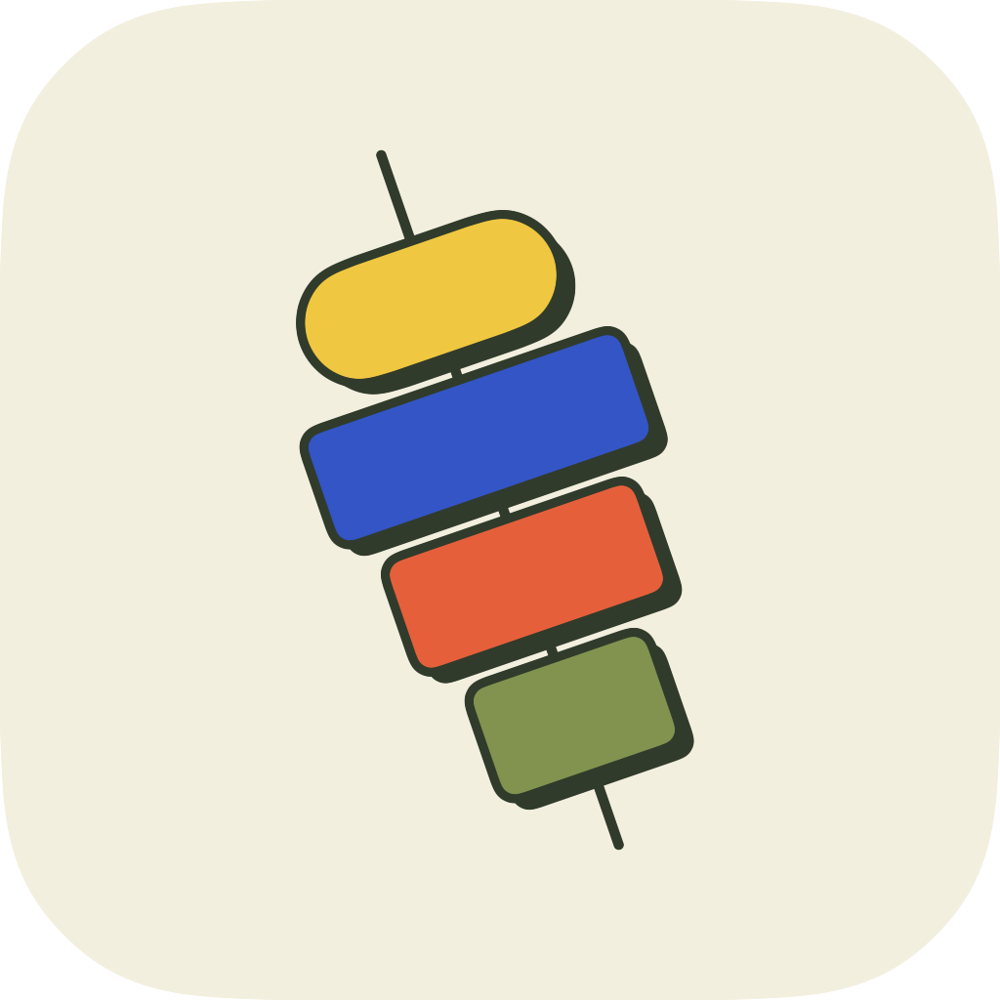

  

<h1 align="center">Tapas</h1>

<strong>Small tools. Good company.</strong>

Local dictation and meeting transcripts for Mac.

  <a href="https://github.com/adgapar/tapas/releases/latest"><strong>Download for Mac</strong></a>
  · <a href="https://github.com/adgapar/tapas/releases/tag/v0.1.4">What’s new</a>

Apple silicon · macOS 15 or later

## Why “tapas”?

Tapas are small Spanish dishes enjoyed together, often over a conversation.
The name borrows that idea: **small tools, each with a clear job**, ready when
you need them. Dictado puts a thought into words. Acta keeps a conversation.
Use either on its own, or let them keep you company throughout the day.

The colorful mark is our **pintxo**, inspired by the Basque bite often held
together with a small pick. Its four ingredients bring the same warmth and
personality to each tool. **Small tools. Good company.**

## Two small tools

| | Dictado | Acta |
| --- | --- | --- |
| Reach for it when… | You want to write by speaking. | You want to keep a meeting or conversation. |
| It captures | Your voice. | Your microphone and a selected app’s audio. |
| You get | Text in the app you’re using, with optional local history. | A timestamped Markdown transcript. |

### Dictado · Speak your next sentence

*Dictado means “dictation.”* Use it for a message, a note, or a whole paragraph
without leaving the app in front of you.

1. Press **Control–Option** to start a take.
2. Speak. A small recording signal stays visible; live words are optional.
3. Press again. Your words return to the app you were using.

Change the shortcut in Preferences. Turn on history to keep a redacted Markdown
copy of each take. If automatic paste is unavailable, copy your words from Tapas.

### Acta · Stay in the conversation

*An acta is a written record of a meeting.* Keep what was said in a call,
interview, or discussion, with your microphone and meeting audio in one transcript.

1. Open Acta with **Control–Shift–M**, or from Tapas’s home.
2. Choose the meeting app and start recording when everyone is ready.
3. Pause or resume from the floating Pintxo. Finish to save a timestamped Markdown file.

Tapas can offer to open Acta when another app uses the microphone. Recording
starts only when you choose it. No meeting bot or calendar connection is needed.

## Your words stay useful

**Capture on your Mac. Keep your files. Build whatever comes next.**

Transcription runs on your Mac. Saved transcripts are ordinary Markdown files
in a folder you choose (default **`~/Documents/tapas/`**). Both tools share this
location, with their own subfolders. Open files in your editor, search them, or
use them with your favorite AI tools and scripts. You choose what gets access.

**Your files are the interface.** Tapas handles capture; you choose what to do
with the result.

No Tapas account is required. Your files remain yours to read and use outside
the app.

## Make yourself at home

1. **Download** the DMG and drag Tapas into Applications.
2. **Open Tapas** for a four-step welcome: meet the tools, allow access, choose a
   transcript folder, and try a private practice take. You can finish later.
3. **Open Tapas from the Dock or Applications** for Dictado, Acta, Recent and Preferences.
   The pintxo in your menu bar is a shortcut to the same tools.

Tapas is signed and notarized for macOS. Future releases arrive through automatic
updates; you can also choose **Check for Updates…** in the app.

## A few useful details

- Dictation supports 25 European languages, including English, Spanish, French,
  German, Portuguese and Ukrainian.
- Acta saves transcripts with microphone and app-audio labels. Summaries, action
  items and individual speaker identification are not included yet.
- For browser meetings, selecting the browser can capture audio from its other
  tabs too. Start recording when everyone is ready; headphones help keep the
  two audio sources clear.
- Audio and transcripts are processed locally. Model downloads, SDK usage/licensing
  reporting and app updates use the network. Privacy and license notices are
  included inside the app.

[Report an issue](https://github.com/adgapar/tapas/issues) ·
[Releases](https://github.com/adgapar/tapas/releases) ·
[Developer documentation](docs/README.md)

Powered by [Desert Ant Labs](https://desertant.com).
Automatic updates by [Sparkle](https://sparkle-project.org).
