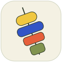

  

<h1 align="center">Tapas</h1>

<strong>Small tools. Good company.</strong>

Local dictation and meeting transcripts for Mac.

  <a href="https://github.com/adgapar/tapas/releases/latest"><strong>Download for Mac</strong></a>
  · <a href="https://github.com/adgapar/tapas/releases/tag/v0.1.0">What’s new</a>

Apple silicon · macOS 15 or later

## Why Tapas?

Tapas are small Spanish dishes enjoyed together, often over a conversation.
That is the idea behind the app: a plate of small, useful tools, each with a
clear job. Reach for Dictado to put a thought into words, or Acta to keep a
conversation. Choose what you need throughout your day.

The colorful mark is our **pintxo**, inspired by the Basque bite often held
together with a small pick. Four distinct ingredients—saffron, cobalt, paprika
and olive—come together on one pick. That shared identity carries through the
app: tools with their own purpose, a familiar home, and a little personality.

Even the names describe what the tools do: **dictado** means dictation in
Spanish; an **acta** is the written record of a meeting. **Small tools. Good
company.** brings those useful little companions and the warmth of sharing
tapas into one line.

## Two small tools for your words

### Dictado — say it, then get on with it

Press **Control–Option**, speak, and press again. Dictado turns your voice into
text and puts it in the app you were using. A small recording indicator stays
out of the way, and optional live words let you follow along.

Change the shortcut to suit you. Keep a local history when you want one.

### Acta — stay in the conversation

Capture your microphone and the audio from your meeting app. Tapas can offer
to start Acta when another app uses the microphone—you decide when to record.
A floating companion keeps pause, resume and finish within reach.

Finish the meeting and keep a timestamped transcript in Markdown. No meeting
bot or calendar connection needed.

## Your words stay useful

Transcription runs on your Mac. Saved transcripts are ordinary Markdown files
in **`~/Documents/tapas/`**: open them in your editor, search them, or use them
with your favorite AI tools and scripts. You choose what gets access.

No Tapas account is required. Your files remain yours to read and use outside
the app.

## Make yourself at home

1. **Download** the DMG and drag Tapas into Applications.
2. **Open Tapas** and follow the short setup to prepare voice models and permissions.
3. **Find the pintxo in your menu bar** to open Dictado, Acta, Recent and Preferences.

Tapas is signed and notarized for macOS. Future releases arrive through automatic
updates; you can also choose **Check for Updates…** in the app.

## A few useful details

- Dictation supports 25 European languages, including English, Spanish, French,
  German, Portuguese and Ukrainian.
- Acta saves transcripts with microphone and app-audio labels. Summaries, action
  items and individual speaker identification are not included yet.
- For browser meetings, selecting the browser can capture audio from its other
  tabs too. Start recording when everyone is ready; headphones help keep the
  two audio sources clear.
- Audio and transcripts are processed locally. Model downloads, SDK usage/licensing
  reporting and app updates use the network. Privacy and license notices are
  included inside the app.

[Report an issue](https://github.com/adgapar/tapas/issues) ·
[Releases](https://github.com/adgapar/tapas/releases)

Powered by [Desert Ant Labs](https://desertant.com).
Automatic updates by [Sparkle](https://sparkle-project.org).
